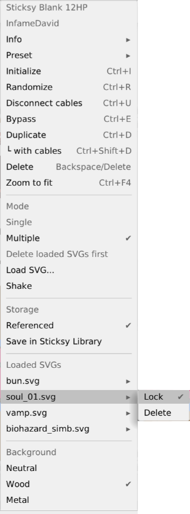
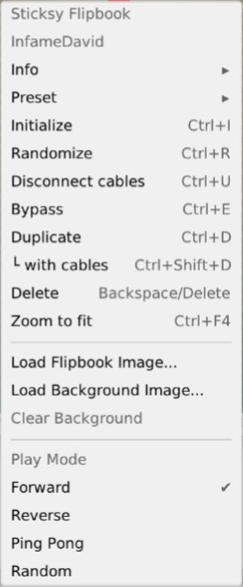
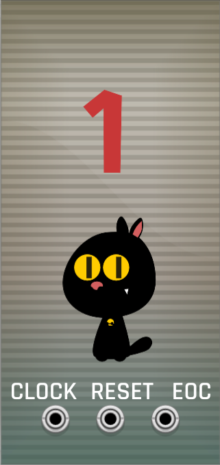

# Sticksy

Sticksy is a decorative SVG sticker plugin for VCV Rack.

## QUICK START:

Right-click on the panel.

### Sticksy Blank

**Single** loads one SVG image centered on the panel.

**Multiple** lets you load several SVG stickers placed randomly on the panel.

**Shake** randomly repositions the loaded stickers.

**Lock** keeps a sticker in place when using Shake.

Locked stickers can still be removed with **Delete**.

### Sticksy Flipbook

Sticksy Flipbook plays an SVG image sequence with a clock.

Use **Load Flipbook Image...** and select any SVG from a numbered sequence.

Example:

gato_01.svg
gato_02.svg
gato_03.svg

